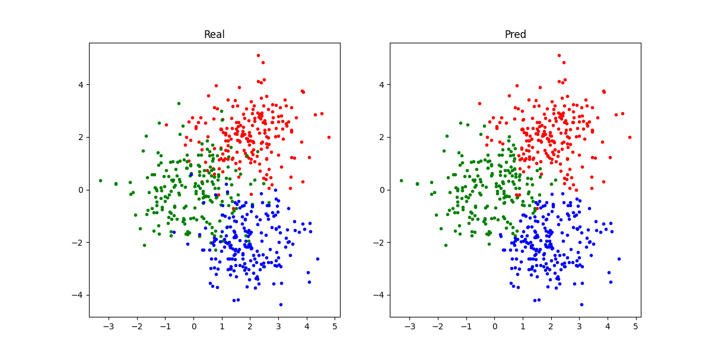

<h2 align="center"> K 近邻算法</h2>

K近邻（KNN）分类算法是数据挖掘分类技术中最简单的方法之一。所谓K近邻，就是K个最近的邻居的意思，说的是每个样本都可以用它最接近的K个邻近值来代表。近邻算法就是将数据集合中每一个记录进行分类的方法。

#### 一. 原理

KNN算法的核心思想是，如果一个样本在特征空间中的K个最相邻的样本中的大多数属于某一个类别，则该样本也属于这个类别，并具有这个类别上样本的特性。该方法在确定分类决策上只依据最邻近的一个或者几个样本的类别来决定待分样本所属的类别。KNN方法在类别决策时，只与极少量的相邻样本有关。由于KNN方法主要靠周围有限的邻近的样本，而不是靠判别类域的方法来确定所属类别的，因此对于类域的交叉或重叠较多的待分样本集来说，KNN方法较其他方法更为适合。

#### 二. 算法

**输入：**训练集：$D = \{(x_1,y_1),(x_2,y_2),\cdots,(x_N,y_N)\}$.

**输出：**实例$x$所属的类$y$.

1. 给定距离度量，在训练集$D$钟找出与$x$最近的$k$个点记为$N_k(x)$;

2. 在$N_k(x)$中根据分类决策规则决定x的类别$y$：

    $$
    y = \mathop{argmax}_{c_j} \sum_{x_i \in N_k(x)} I(y_i = c_j), i=1,2,\cdots,N;j=1,2,\cdots,K
    $$
    其中，$I$为指数函数，即当$y_i=c_i$时为$1$，否则为$0$.


#### 三. 实现

KNN的实现相对简单，

```python
class KNN:
    """
    K nearest neighbor classifier(K近邻分类器)
    """

    def __init__(self, k: int):
        """
        Args:
            k (int): 分类近邻数
        """
        self.k, self.X, self.Y = k, None, None

    def fit(self, X: np.ndarray, Y: np.ndarray):
        self.X, self.Y = X, Y  # 训练集X与Y，类别已知

    def __call__(self, X: np.ndarray):
        Y = np.zeros([len(X)], dtype=int)  # X对应的类别输出变量
        for i, x in enumerate(X):
            dist = np.linalg.norm(self.X - x, axis=1)  # 计算x与所有已知类别点的距离
            topk = np.argsort(dist)[:self.k]  # 取距离最近的k个点对应的索引
            counter = np.bincount(self.Y[topk])  # 统计k近邻点的类别数量
            Y[i] = np.argmax(counter)  # k近邻次数最多的类别将作为x的类别
        return Y
```

#### 四. 效果

首先准备数据集：

```python
def load_data():
    x = np.stack([np.random.randn(200, 2) + np.array([2, 2]),
                  np.random.randn(200, 2),
                  np.random.randn(200, 2) + np.array([2, -2])])
    y = np.stack([np.full([200], 0), np.full([200], 1), np.full([200], 2)])
    return x, y
x, y = load_data()
```

然后画出原始数据集分布：

```python
plt.figure(figsize=[12, 6])
plt.subplot(1, 2, 1)
plt.title('Real')
plt.scatter(x[0, :, 0], x[0, :, 1], color='r', marker='.')
plt.scatter(x[1, :, 0], x[1, :, 1], color='g', marker='.')
plt.scatter(x[2, :, 0], x[2, :, 1], color='b', marker='.')
```

使用KNN对数据集分类：

```python
x, y = x.reshape(-1, 2), y.flatten()
knn = KNN(3)
knn.fit(x, y)
pred = knn(x)
acc = np.sum(pred == y) / len(pred)
print(f'Accuracy = {100 * acc:.2f}%')
```

画出分类完成的数据集分布：

```python
x0, x1, x2 = x[pred == 0], x[pred == 1], x[pred == 2]
plt.subplot(1, 2, 2)
plt.title('Pred')
plt.scatter(x0[:, 0], x0[:, 1], color='r', marker='.')
plt.scatter(x1[:, 0], x1[:, 1], color='g', marker='.')
plt.scatter(x2[:, 0], x2[:, 1], color='b', marker='.')
plt.show()
```

结果如下：



精度为93%，可以看出KNN对于这种比较简单的分类还有不错的效果的。

