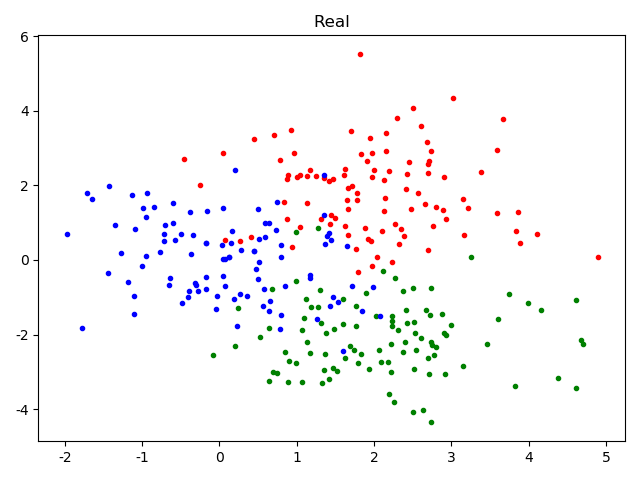
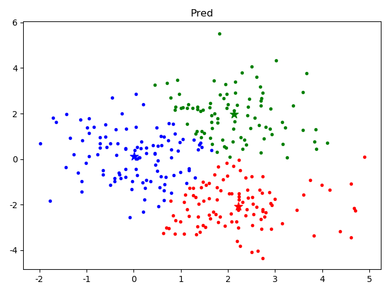

Python实现：
```python
import random
import numpy as np


class KMeans:
    """
    K-means clustering
    """

    def __init__(self, k: int, eps: float = 1e-3, iterations=100):
        self.k, self.eps, self.iterations = k, eps, iterations
        self.centers = None

    def predict(self, X: np.ndarray):
        Y = np.zeros([len(X)], dtype=int)
        self.centers = X[random.sample(range(len(X)), self.k)]  # centers
        for _ in range(self.iterations):
            for i, x in enumerate(X):
                Y[i] = np.linalg.norm(self.centers - x, axis=1).argmax()
            means = np.empty_like(self.centers)  # means
            for i in range(self.k):
                if np.any(Y == i):
                    means[i] = np.mean(X[Y == i], axis=0)
                else:
                    means[i] = X[np.random.randint(0, len(X))]
            if np.max(np.abs(self.centers - means)) < self.eps:
                break
            self.centers = means
        return Y
```


真实值：



聚类后：

