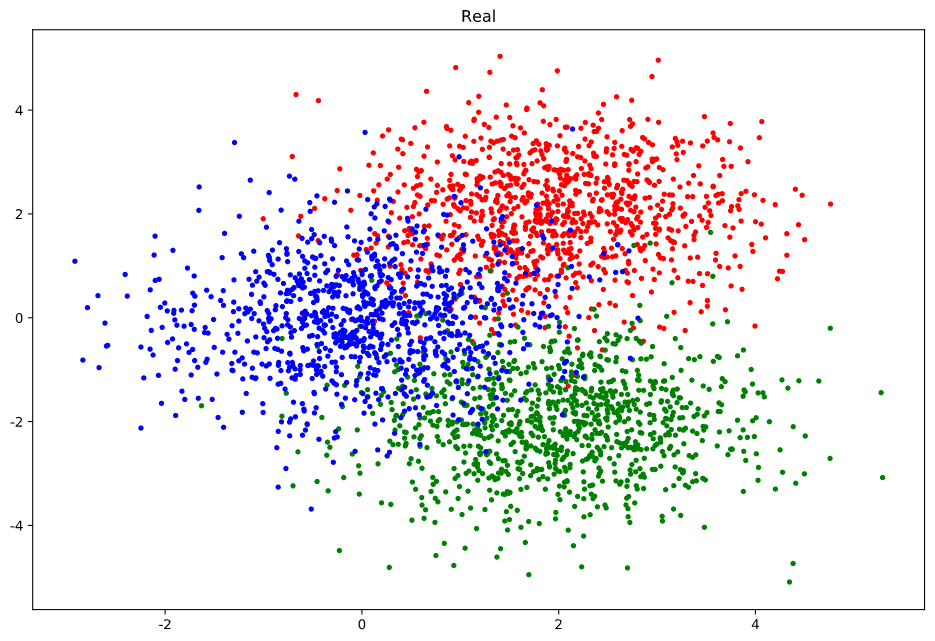
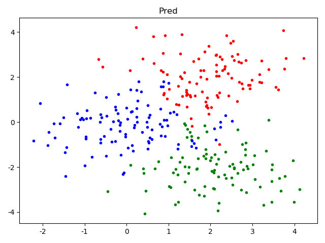

Python实现：
```python
from collections import Counter
import numpy as np


class KNN:
    """
    K nearest neighbor classifier
    """

    def __init__(self, K: int):
        self.K, self.X, self.Y = K, None, None

    def fit(self, X: np.ndarray, Y: np.ndarray):
        self.X, self.Y = X, Y

    def predict(self, X: np.ndarray):
        Y = np.zeros([len(X)], dtype=int)
        for i, x in enumerate(X):
            dist = np.linalg.norm(self.X - x, axis=1)
            topk = np.argsort(dist)[:self.K]
            counter = Counter(self.Y[topk])
            Y[i] = counter.most_common(1)[0][0]
        return Y
```


真实值：



预测值：

