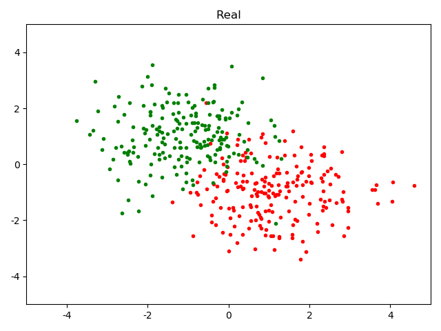
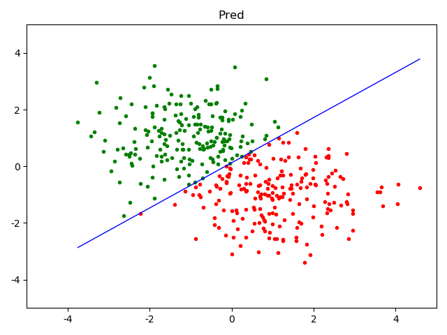

Python实现：
```python
import numpy as np


class LogisticRegression:
    """
    Logistic regression classifier
    """

    def __init__(self, input_dim, lr=0.01):
        self.weights = np.random.randn(input_dim + 1)
        self.lr = lr

    def fit(self, X, Y):
        x_pad = self.pad(X)
        pred = self.sigmoid(x_pad @ self.weights)
        grad = x_pad.T @ (pred - Y) / len(pred)
        self.weights -= self.lr * grad

    def predict(self, X):
        x_pad = self.pad(X)
        pred = self.sigmoid(x_pad @ self.weights)
        return self.binarize(pred)

    @staticmethod
    def pad(x):
        return np.concatenate([x, np.ones([len(x), 1])], axis=1)

    @staticmethod
    def sigmoid(x):
        """
        :param x:
        :return: \frac{1}{1 + e^{-x}}
        """
        return 1 / (1 + np.exp(-x))

    @staticmethod
    def binarize(x, threshold=.5):
        b = np.zeros([len(x)])
        b[x > threshold] = 1
        return b
```


真实值：



预测值：

