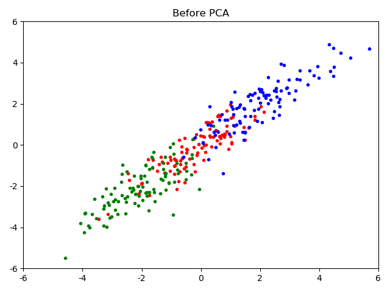
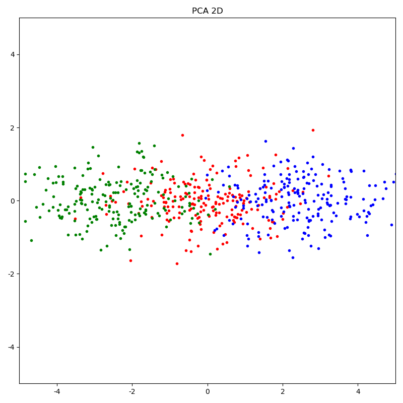
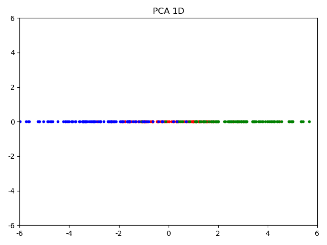

Python实现：
```python
import numpy as np


def pca(X: np.ndarray, K: int):
    """
    Principal Components Analysis
    """
    Y = X - X.mean(axis=0)
    L, U = np.linalg.eig(Y.T @ Y)
    topk = np.argsort(L)[::-1][:K]
    return Y @ U[:, topk]
```


降维前：


PCA 2D：


PCA 1D：
